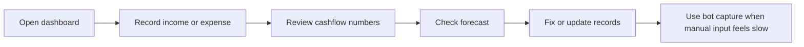

# 💸 Feel-Better Cashflow Dashboard

A simple personal finance dashboard that makes cashflow tracking faster, clearer, and less stressful.

[](https://feelbetter-cashflow-dashboard.base44.app/)


> **Feel-Better Cashflow Dashboard**, also called **F-finance**, is designed for people who want to understand their money without using a heavy accounting tool.


---

## 📖 Overview

Many finance apps are powerful, but they often ask users to behave like accountants. **F-finance** takes a simpler approach: record money quickly, review the important numbers, and fix details later when needed.

The dashboard focuses on everyday cashflow questions:

- 💰 How much money came in this month?
- 💸 How much went out this month?
- 📊 What is the net cashflow?
- 🔁 Which records are monthly, and which are one-time?
- 🔮 What could the next few months look like?
- ⚡ Can spending be recorded quickly without opening a complex form?

The goal is to make money review feel lighter, calmer, and easier to continue.

---

## ✨ Feature Highlights

| Feature | Description | Why It Matters |
|---|---|---|
| 👤 Guest mode | Try the dashboard before creating an account | Low-friction demo experience |
| 🧾 Simple / detailed record modes | Choose between quick input and more controlled entry | Supports both casual and careful tracking |
| 🔁 Monthly & one-time records | Separate recurring records from one-off transactions | Cleaner cashflow planning |
| 🔮 Cashflow projection | Forecast future months using recurring and one-time records | Helps users see upcoming money pressure |
| 🕘 Recent records | Highlights recent non-monthly income and expenses | Avoids overwhelming the dashboard |
| 📥 CSV import | Add many records from a CSV file | Faster migration and bulk testing |
| 🌍 Multi-currency display | Choose a currency symbol and matching advice context | Better for users outside one default market |
| 🈯 Traditional Chinese support | Switch between English and Traditional Chinese | More accessible for Hong Kong / Traditional Chinese users |
| 🤖 Chat-style capture | Convert natural money messages into draft records | Faster than manual forms for quick spending notes |
| 🌤️ Money weather | Uses simple visual feedback for cashflow condition | Makes finance review feel less intimidating |

---

## 🖥️ Dashboard

The dashboard gives users a quick view of their current money position.

### Key dashboard metrics

| Metric | Meaning |
|---|---|
| This month income | Total income recorded for the current month |
| This month expense | Total expense recorded for the current month |
| Net cashflow | Income minus expense |
| Savings rate | How much of the income remains after expenses |
| Recurring monthly income | Income that repeats monthly |
| Recurring monthly expense | Expenses that repeat monthly |
| Forecast projection | Future cashflow based on recurring and dated one-time records |
| Recent income / expense | Latest non-monthly records for quick review |
| Category breakdown | Spending/income grouping when enough data exists |

The dashboard also includes a small **money weather** idea: stronger cashflow can feel sunny, normal cashflow can feel cloudy, and weaker cashflow can feel rainy.


---

## 📝 Record Page

The Record page is where users add, review, edit, and delete money records.

| Function | Supported |
|---|---:|
| Quick income entry | ✅ |
| Quick expense entry | ✅ |
| Recurring monthly checkbox | ✅ |
| CSV import | ✅ |
| Edit records | ✅ |
| Delete records | ✅ |
| Monthly / non-monthly record views | ✅ |
| Pagination for larger lists | ✅ |

The goal is to keep basic input fast while still allowing users to correct mistakes later.

---

## 🤖 Connect Bot Page

The Connect Bot page is built for fast money capture from chat-style messages.

Users can type natural messages such as:

```text
lunch 58
mtr 12 coffee 42
salary 30000
rent 15000 monthly
I get 450 rebate from credit card
Mom gave me 300 as red packet and I bought coffee for 50
```

Instead of saving immediately, the bot flow turns messages into **draft records** first. Users can review and fix the draft before saving it.

### Supported bot-style flows

| Flow | Purpose |
|---|---|
| Telegram-style capture | Record money through short chat messages |
| Signal bridge-style capture | Support external chat capture workflow |
| Draft review before saving | Prevent incorrect records from being saved too quickly |
| Recurring monthly detection | Recognize monthly records from message context |
| AI-assisted parsing | Extract income / expense meaning from sentence-style messages |


---

## 😊 Feel Better Mode

**Feel Better Mode** is a lightweight AI money check. It gives the user short, kind, and practical feedback based on expected monthly income and expected monthly expense.

| Input | Output |
|---|---|
| Expected monthly income | A short cashflow comment |
| Expected monthly expense | A simple money-health interpretation |
| Selected currency context | Advice written with the matching currency feel |

The response is intentionally short, direct, and sometimes humorous. It is not meant to be a long finance lecture — it is meant to make money review feel easier to start.


---

## 🧭 User Workflow



A typical user flow is:

1. Open the app.
2. Record money quickly.
3. Review obvious cashflow numbers.
4. Check the forecast.
5. Fix mistakes later.
6. Use chat-style capture when manual input feels too slow.

---

## 🛠️ Built With

| Category | Technology |
|---|---|
| Frontend | React, Vite |
| Styling | Tailwind CSS, custom dashboard styles |
| Backend | Base44 backend functions |
| Database | Base44 entities |
| AI | Hugging Face compatible inference |
| Bot flows | Telegram and Signal-style capture |
| Language support | English, Traditional Chinese |

---


