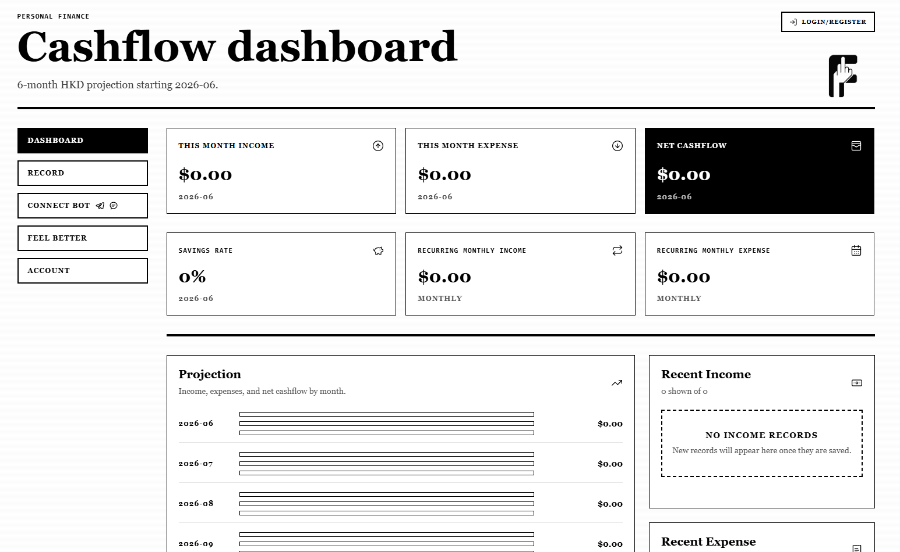
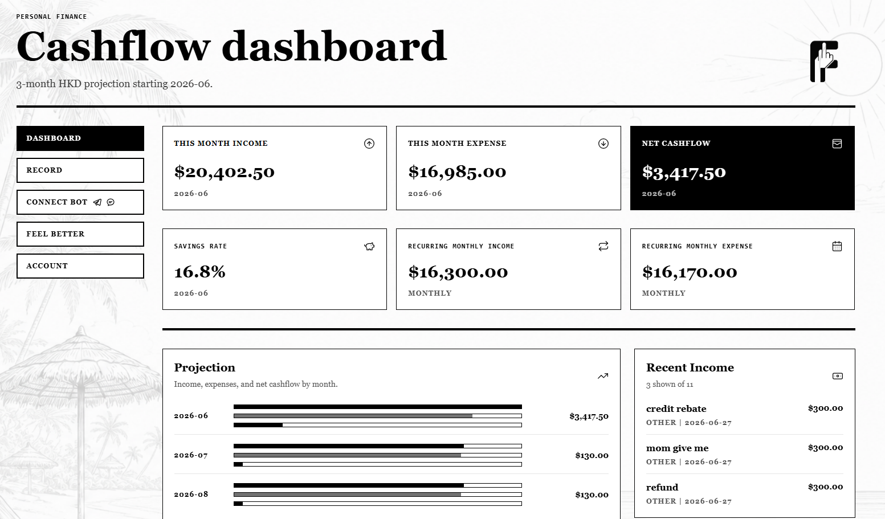
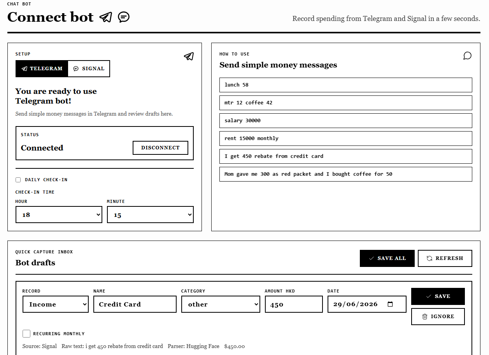
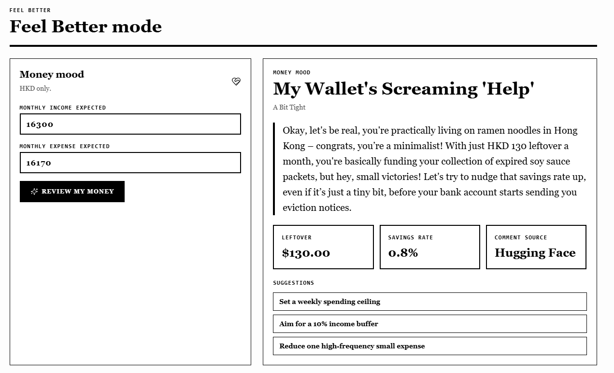

# Feel-Better Cashflow Dashboard

A personal finance dashboard that makes cashflow tracking faster, simpler, and less stressful.

Live app: [feelbetter-cashflow-dashboard.base44.app](https://feelbetter-cashflow-dashboard.base44.app/)



## What It Is

Feel-Better Cashflow Dashboard, short form **F-finance**, is built for people who want to understand their money without using a heavy accounting tool.

The app focuses on everyday cashflow:

- How much came in this month?
- How much went out this month?
- What is left?
- Which records are monthly, and which are one-time?
- What does the next few months look like?
- Can I record spending quickly without opening a complex form?

It is designed to feel simple first, but still useful when the user wants more detail.

## Feature Highlights

| Feature | Why it is useful |
|---|---|
| Guest mode | Lets people try the dashboard before creating an account. Guest data is temporary. |
| Simple and detailed modes | Simple mode keeps input light. Detailed mode gives more control over records. |
| Monthly and one-time records | Recurring income/expenses stay separate from non-monthly records for cleaner planning. |
| Cashflow projection | Shows future months using recurring records plus one-time records in the month they happen. |
| Recent records | Dashboard focuses on the latest non-monthly income and expense records instead of overwhelming the user. |
| CSV import | Adds many records at once from a single file. |
| Multi-currency display | Users can choose a currency symbol and get advice in a matching currency context. |
| Traditional Chinese support | The interface can switch between English and Traditional Chinese. |

## Dashboard

The dashboard gives a fast view of the user's current money position.

It includes:

- this month income
- this month expense
- net cashflow
- savings rate
- recurring monthly income
- recurring monthly expense
- forecast projection
- recent income
- recent expense
- category breakdown when enough data exists

The dashboard also uses a subtle "money weather" idea. Better cashflow can feel sunny, normal cashflow can feel cloudy, and weaker cashflow can feel rainy.



## Record Page

The Record page is where users add and fix data.

It supports:

- quick income entry
- quick expense entry
- recurring monthly checkbox
- CSV import
- record management
- edit and delete actions
- monthly vs non-monthly record views
- pagination for larger record lists

The goal is to keep basic input quick while still allowing corrections when mistakes happen.

Screenshot slot:

> Record page screenshot will be added here.

## Connect Bot Page

The Connect Bot page is for quick capture from chat.

Users can write natural money messages such as:

```text
lunch 58
mtr 12 coffee 42
salary 30000
rent 15000 monthly
I get 450 rebate from credit card
Mom gave me 300 as red packet and I bought coffee for 50
```

The bot flow turns messages into draft records first, so the user can review and fix them before saving.

Supported bot-style flows:

- Telegram
- Signal bridge
- draft review before saving
- recurring monthly detection
- AI-assisted parsing for sentence-style messages



## Feel Better Mode

Feel Better mode is a lightweight AI money check.

The user enters:

- expected monthly income
- expected monthly expense

Then the app returns a short comment that is:

- kind
- direct
- humorous
- based on the selected currency context
- intentionally short, not a long finance lecture

It is meant to make money review feel less intimidating.



## Why It Is Different

Many finance apps are powerful but ask users to behave like accountants.

F-finance is built around a different workflow:

1. Open the app.
2. Record money quickly.
3. Review obvious cashflow numbers.
4. Fix mistakes later.
5. Use chat-style capture when manual input feels too slow.

The interesting part is not only the dashboard. It is the combination of simple input, reviewable drafts, recurring planning, guest trial, and short AI feedback.

## Built With

| Category | Technology |
|---|---|
| Frontend | React, Vite |
| Styling | Tailwind CSS, custom dashboard styles |
| Backend | Base44 backend functions |
| Database | Base44 entities |
| AI | Hugging Face compatible inference |
| Bot flows | Telegram and Signal-style capture |

## Repository Notes

This public repository contains sanitized source code only.

It does not include:

- production API keys
- bot tokens
- server IP addresses
- private deployment notes
- private environment files
